# Forensic-Tools

A curated collection of **Digital Forensics, Cyber Forensics, and Incident Response tools**, organized by their primary forensic use case.

> **Note:** Always verify tool versions, licenses, and acquisition procedures before using any forensic tool in a real investigation. Preserve original evidence and work on forensic copies whenever possible.

---
# 🔎 Quick Review Forensic Tools

| Tool Purpose| GUI Tool | Command-Line Tool |
|---|---|---|
| Encrypted Detection | | [Magnet Encrypt Detector](https://www.magnetforensics.com/resources/encrypted-disk-detector/) | 
| Disk Imaging Tool| FTK Imager, Encase | FTK, Encase |
| Disable Disk Writer | FTK Imager(Image mounting), Write Blocker| |
| File Carving & Analyser Tool | FTK Imager, Autopsy, PhotoRec| FTK, TSK |
| Image Metadata Extraction | [ExifTool](https://exiftool.org/) | |
| Incident Response Triage Utilities | KAPE, [Magnet Response](https://www.magnetforensics.com/resources/magnet-response/) | KAPE |
| Live Memory Capture | FTK, [Magnet Ram Capture](https://www.magnetforensics.com/resources/magnet-ram-capture/) | FTK, [Magnet DumpIt](https://www.magnetforensics.com/resources/magnet-dumpit-for-windows/) |
| Memory Analysis | Volatility Workbench, Redline | Volatility |
| Email Forensic | [Thunderbird](https://www.thunderbird.net/) | extract email artifacts|
| Network Forensic | Wireshark| |
| Mobile Forensics | Oxygen, MOBILedit, Cellebrite UFED, Magnet AXIOM | |

---
## 📑 Table of Contents

- [Forensic Imaging & Carving Tools](#forensic-imaging-and-carving-tools)
- [Memory Forensic Tools](#memory-forensic-tools)
- [Network Forensic Tools](#network-forensic-tools)
- [Mobile Forensic Tools](#mobile-forensic-tools)
- [Incident Response](#incident-response)
- [Forensic Workflow](#forensics-workflow)
- [Tool Setup Procedure](#tool-setup-procedure)
- [Sample Images References](#references)
---

# Forensic Imaging and Carving Tools
  > [Autopsy](https://www.autopsy.com/download/) is not a Forensic Imaging Tool But it is a Forensic Image Analysis Tool(Open Source) & Also File Carving Tool.
  > [KAPE](https://www.kroll.com/en/insights/publications/cyber/kape) is used for Browser Artifact Tool. 

| Forensic Tool | Type | Description |
|---|---|---|
| [FTK Imager](https://www.exterro.com/ftk-product-downloads/ftk-imager-version-4-7-1) | Free | `Tool`: Imaging(Volatile & Non-Volatile), Carving, Mounting; `Uses`: file, disk & registry analysis |
| [Encase](https://www.opentext.com/products/forensic) | Paid | `Tool`: Imaging, Carving; `Uses`: gathering & analysing digital evidence across computers, mobile devices & networks |
| [ProDiscover Forensics](https://prodiscover.com/) | Paid | `Tool`: forensic software suite; `Uses`: capture & analyze disk images, recover deleted files & investigate data for evidence|
| [dd/dc3dd](https://www.gnu.org/software/coreutils/manual/html_node/dd-invocation.html) | Free | Standard Unix utility used for bit-by-bit copying and creating raw disk images. |
| [Guymager](https://guymager.sourceforge.io/) | Free | Open-source GUI forensic imager supporting raw and EWF image formats with detailed acquisition logs. |
| [X-Ways Forensic](https://x-ways.net/forensics/) | Free | `Uses`: file carving, slack space analysis, advanced searching, & metadata extraction |

---

# Memory Forensic Tools

| ForensicTool | Type | Description |
|---|---|---|
| [Volatility](https://volatilityfoundation.org/) | Open Source | `Uses`: Depth Analysis of RAM to detect malware, rootkits & other security incidnets | 
| [Redline](https://fireeye.market/apps/211364) | Free |  `Uses`: Disk/Memory forensic, `Focused`: identifying Potential Malware Infection & Persistence Mechanisms | 
| [Rekall Framework](https://github.com/google/rekall) | Free |  `Uses`: Analyse memory dump for malware & rookit detection | 
| [LiME](https://github.com/504ensicsLabs/LiME) | Free | Linux Memory Extractor used to acquire volatile memory from Linux and Android systems. |
| [Velociraptor](https://github.com/Velocidex/velociraptor) | Free | Endpoint visibility, digital forensic collection, and incident-response platform capable of collecting volatile and persistent artifacts. |

---

# Network Forensic Tools

| Forensic Tool | Type | Description |
|---|---|---|
| [Wireshark](https://www.wireshark.org/) | Free | `Uses`: allow user to capture, inspect & analyze data packets |
| [tcpdump](https://www.tcpdump.org/) | Free | Command-line packet capture and network traffic analysis utility. |
| [Suricata](https://suricata.io/) | Free | Open-source network threat detection engine supporting IDS, IPS, and network security monitoring. |
| [NetworkMiner](https://www.netresec.com/?page=NetworkMiner)| Free | `Uses`: capture & analyse network traffic; `Focus`: extracting files & metadata |

---

# Mobile Forensic Tools
| Forensic Tool | Type | Description |
|---|---|---|
| [Oxygen Forensic](https://www.oxygenforensics.com/) | Cracked Free | `Uses`: extract & analyze data from smartphone, applications & cloud services |
| [Cellebrite UFED](https://cellebrite.com/en/ufed/) | Paid | Commercial mobile-device acquisition and extraction platform. |
| [Magnet AXIOM](https://www.magnetforensics.com/products/magnet-axiom/) | Paid | `Uses`: specializes in recovering digital evidence from mobile devices, computers & cloud services |
| [iLEAPP](https://github.com/abrignoni/iLEAPP) | Free | Open-source tool for parsing iOS forensic artifacts. |
| [ALEAPP](https://github.com/abrignoni/aLEAPP) | Free | Open-source tool for parsing Android forensic artifacts. |
| [Bulk Extractor](https://github.com/simsong/bulk_extractor/wiki/Installing-bulk_extractor) | Free | `Uses`: scan media & extracts data like email addresses, URLs & credit card numbers useful for rapid evidence discovery |
| [Belkasoft Evidence Center](https://belkasoft.com/get) | Free | `Tool`: Digital Forensic Suite; `Uses`: supports data recovery from various devices including comuters, mobile devices & social media |

---


# Incident Response 

| DFIR Tool | Type | Description |
|---|---|---|
| [KAPE](https://www.kroll.com/en/insights/publications/cyber/kape) | Free| Rapid collection and processing of Windows forensic artifacts. |
| [Velociraptor](https://www.velociraptor.com/) | Free| Endpoint monitoring, forensic collection, and incident-response platform. |
| [Dissect](https://github.com/fox-it/Dissect) | Free| Python-based DFIR framework for examining forensic evidence at scale. |
| [CAINE(Linux)](https://www.caine-live.net/) | Open Source| `Uses`:  offers a range of tools for digital forensics, incident response, & evidence acquisition|

---

# Forensics Workflow

```text
                    DIGITAL FORENSICS
                           │
                           ▼
                  Evidence Identification
                           │
                           ▼
                       Preservation
                           │
                           ▼
                  Forensic Acquisition
                           │
                           ▼
                    Hash Verification (Cyptography)
                           │
                           ▼
              +------------+------------+
              │            │            │
              ▼            ▼            ▼
          Disk/FS       Memory       Network
          Analysis      Analysis      Analysis
              │            │            │
              +------------+------------+
                           │
                           ▼
                   Artifact Extraction
                           │
                           ▼
                   Timeline Analysis
                           │
                           ▼
                   Evidence Correlation
                           │
                           ▼
                  Findings & Reporting
                           │
                           ▼
                       Presentation
```

# Tool Setup Procedure
## [Volatility 3 Setup](https://youtu.be/j6cHvcyXKZk?si=EFV6RHIsX1QYfYpq)
Step 1: Download python 3 from terminal & Setup its Environment Variables Path (like C:\Users\Hp\AppData\Local\Programs\Python\Python314)
```
winget install Python.Python.3.14
```
Check Version
```
python --version
```
Step 2: Download zip file from browser & Setup its Environment Variables Path (like C:\Users\Hp\Desktop\volatility3)
```
https://github.com/volatilityfoundation/volatility3
```
Check Version
```
python vol.py --version
```
Step 3: Capture Live Memory  
Step 4: Run this command for Windows info
Syntax
```
python vol.py -f <win-liveimg-fullpath> windows.<command>
```
Eg:
> python vol.py -f C:\Users\Hp\Desktop\DumpIt\x64\ASUS-20260916-044657.dmp windows.info  

Note:
> ctrl+c => use for exit running process
### Imp Volatility Command
| Command             | Description                                                                            |
| ------------------- | -------------------------------------------------------------------------------------- |
| `info`              | Identifies the Windows version and basic information from the memory image.            |
| `pslist`            | Lists processes that were active when the memory image was captured.                   |
| `pstree`            | Displays processes in a parent-child tree structure.                                   |
| `cmdline`           | Shows command-line arguments used to launch processes.                                 |
| `netscan`           | Scans memory for network connections and listening sockets.                            |
| `dlllist`           | Lists DLLs loaded by processes.                                                        |
| `malfind`           | Searches for potentially suspicious or injected code in process memory.                |
| `handles`           | Lists handles opened by processes, such as files, registry keys, and events.           |
| `filescan`          | Scans memory for file objects and file-related artifacts.                              |
| `registry.hivelist` | Lists registry hives found in the memory image.                                        |
| `registry.printkey` | Displays registry key information from a specified registry hive.                      |
| `getsids`           | Displays security identifiers (SIDs) associated with processes.                        |
| `privs`             | Shows privileges associated with processes.                                            |
| `psscan`            | Scans memory for process structures, including processes that may no longer be active. |
| `memmap`            | Displays the virtual memory mappings of a process.                                     |
| `vadinfo`           | Displays Virtual Address Descriptor (VAD) information for process memory regions.      |
| `vadwalk`           | Walks the VAD tree to examine a process's virtual memory regions.                      |
| `modscan`           | Scans memory for loaded kernel modules.                                                |
| `modules`           | Lists kernel modules loaded in the Windows memory image.                               |
| `driverirp`         | Examines IRP handlers associated with Windows drivers.                                 |
| `svcscan`           | Scans memory for Windows services.                                                     |
| `scheduled_tasks`   | Examines scheduled tasks present in the memory image.                                  |
| `consoles`          | Extracts Windows console history and command information when available.               |
| `envars`            | Displays environment variables associated with processes.                              |
| `pslist --pid 1234` | Displays information for a specific process using its PID.                             |

## [TSK Setup](https://youtu.be/EUQ-Gj9VmsE?si=zS3hO7nu9Z1mm0oH)


# References
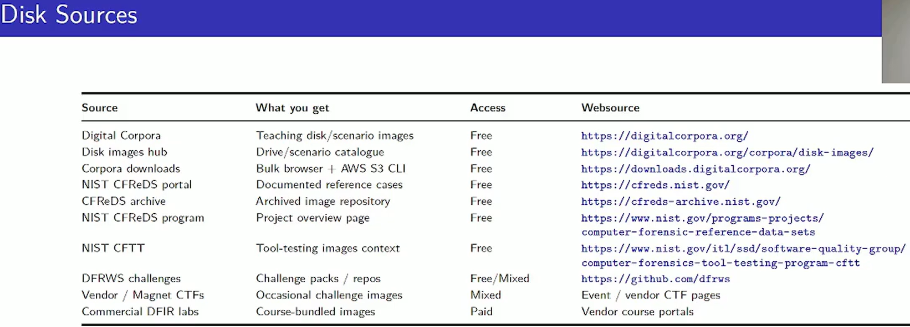
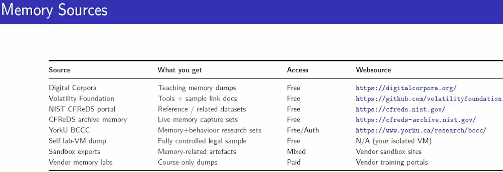
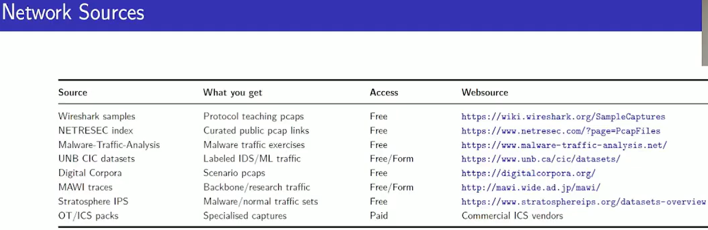
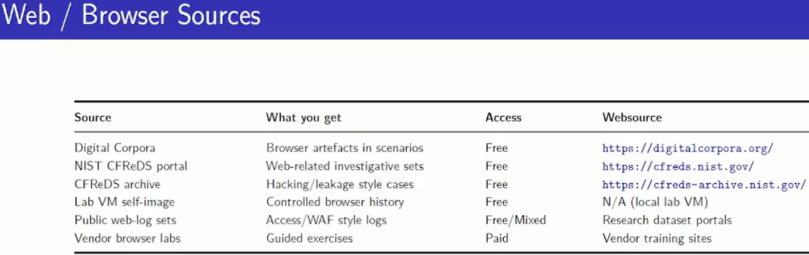
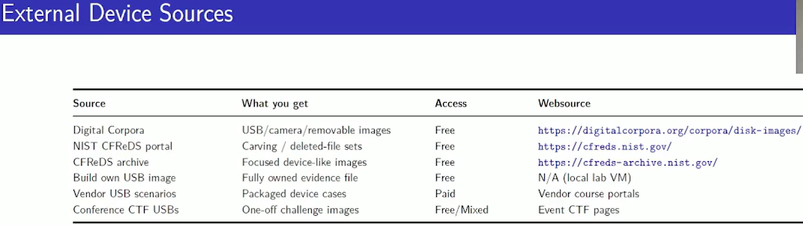
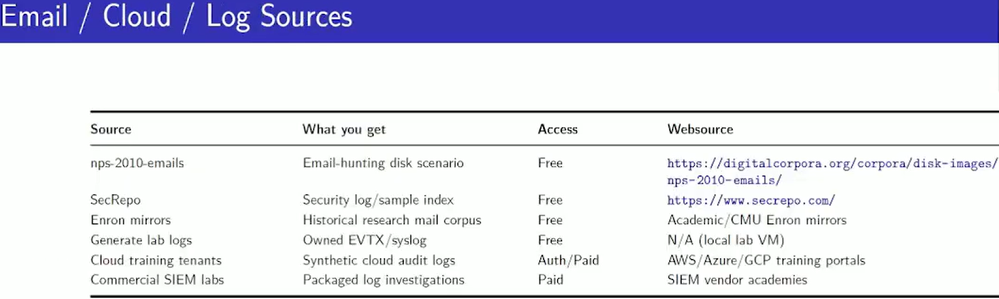
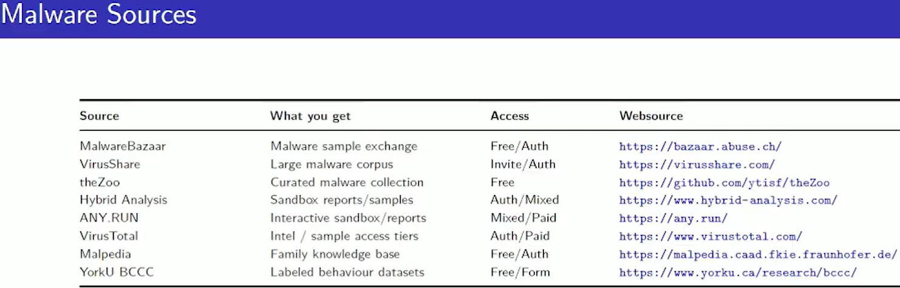
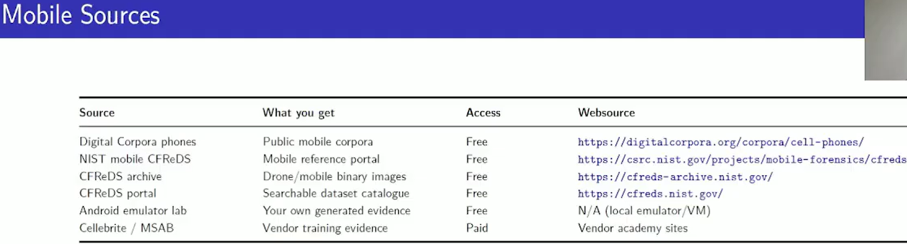
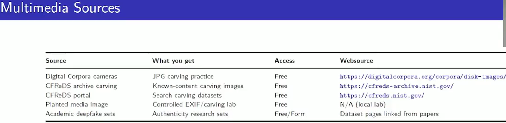
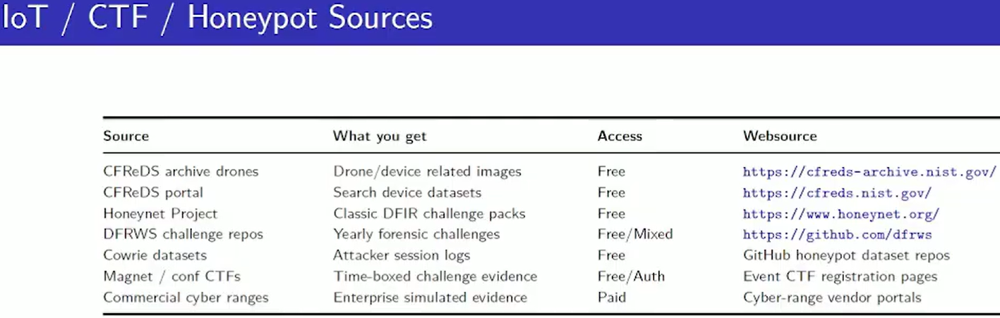
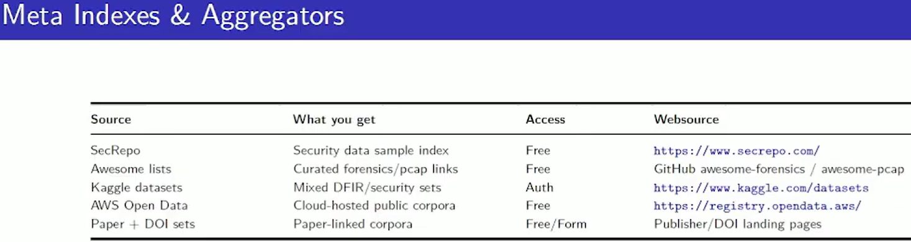
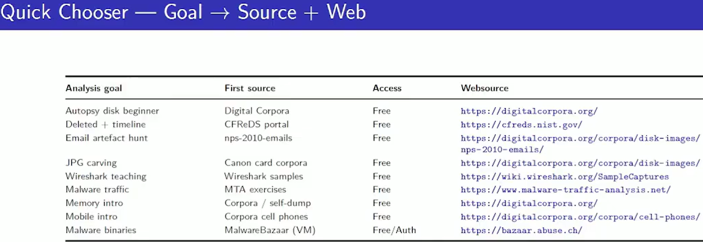


